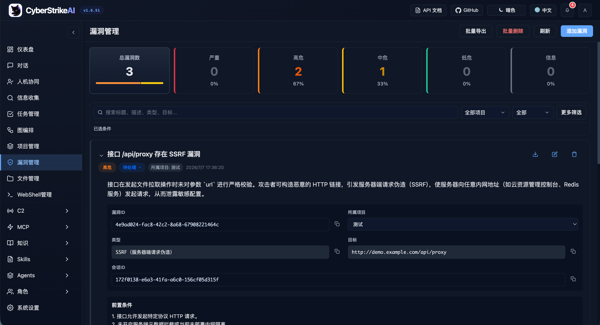

<div align="center">
  
</div>

# CyberStrikeAI

[中文](README_CN.md) | [English](README.md)

**CyberStrikeAI 是 AI 原生网络安全的智能执行中枢——让意图转化为受治理的行动，让证据沉淀为运营记忆，并让每次行动优化下一次行动。**

CyberStrikeAI 将规划、执行、人工监督、证据与复盘连接在同一个可审计工作空间中。项目基于 Go 构建，融合 Eino 智能体、MCP 原生工具、RAG 知识、可视化工作流以及攻击链建模与分析能力，面向已获得明确授权的安全任务。

**从这里开始：** [快速上手](#快速上手一条命令部署) · [中文文档](docs/zh-CN/README.md) · [安全加固](docs/zh-CN/security-hardening.md)

> [!IMPORTANT]
> 仅可对自有系统或已获得明确授权的目标使用 CyberStrikeAI。在共享或生产环境启用高风险工具、WebShell 或 C2 前，请先阅读[安全模型](docs/zh-CN/security-model.md)和[安全加固指南](docs/zh-CN/security-hardening.md)。

## 界面与集成预览

<div align="center">

### 系统仪表盘概览

<table>
<tr>
<td width="50%" align="center">
<strong>浅色模式</strong><br/>

</td>
<td width="50%" align="center">
<strong>深色模式</strong><br/>

</td>
</tr>
</table>

*仪表盘提供系统运行状态、安全漏洞、工具使用情况和知识库的全面概览，帮助用户快速了解平台核心功能和当前状态。*

<details>
<summary><strong>查看更多界面截图</strong></summary>

### 核心功能概览

<table>
<tr>
<td width="33.33%" align="center">
<strong>Web 控制台</strong><br/>

</td>
<td width="33.33%" align="center">
<strong>任务管理</strong><br/>

</td>
<td width="33.33%" align="center">
<strong>漏洞管理</strong><br/>

</td>
</tr>
<tr>
<td width="33.33%" align="center">
<strong>WebShell 管理</strong><br/>

</td>
<td width="33.33%" align="center">
<strong>MCP 管理</strong><br/>

</td>
<td width="33.33%" align="center">
<strong>知识库</strong><br/>

</td>
</tr>
<tr>
<td width="33.33%" align="center">
<strong>Skills 管理</strong><br/>

</td>
<td width="33.33%" align="center">
<strong>Agent 管理</strong><br/>

</td>
<td width="33.33%" align="center">
<strong>角色管理</strong><br/>

</td>
</tr>
<tr>
<td width="33.33%" align="center">
<strong>系统设置</strong><br/>

</td>
<td width="33.33%" align="center">
<strong>MCP stdio 模式</strong><br/>

</td>
<td width="33.33%" align="center">
<strong>Burp Suite 插件</strong><br/>

</td>
</tr>
</table>

</details>

</div>

## 特性速览

### 智能体与编排

- 🤖 **智能体执行层**：将自然语言意图转化为受控、可审计的安全行动。
- 🧩 **Eino 编排**：支持单智能体及 Deep、Plan-Execute、Supervisor 多智能体模式。
- 🔀 **工作流**：通过 Agent、工具、条件、审批和输出节点构建可复用流程。
- 🎭 **角色化测试**：为常见安全场景提供聚焦的提示词和工具策略。

### 工具与知识扩展

- 🧰 **安全工具**：提供 100+ 精选 YAML 工具配方，支持自定义扩展和按角色控制。
- 🔌 **MCP 集成**：支持 HTTP、stdio、SSE、外部 MCP 联邦和动态工具发现。
- 🎯 **Agent Skills**：遵循标准 Skill 目录结构，支持渐进式按需加载。
- 📚 **知识库**：组合查询改写、向量检索、精排和结果后处理能力。
- 🖼️ **视觉分析**：使用独立视觉模型分析截图、验证码和 UI，对话中仅保留文字摘要。

### 安全治理与审计

- 🧑‍⚖️ **人机协同**：支持审批模式、工具白名单、审计 Agent 复核和决策追踪。
- 🔐 **平台 RBAC**：支持多用户、系统及自定义角色、权限 Scope、资源归属和显式授权。
- 🔒 **安全与审计**：提供登录保护、审计日志、SQLite 持久化和行动证据留存。
- 📄 **结果治理**：支持大结果分页、压缩、归档和检索。

### 安全运营管理

- 📁 **对话管理**：支持分组、置顶、重命名和批量管理。
- 📂 **项目与攻击链**：关联跨会话事实、风险评分、图谱视图和步骤回放。
- 🛡️ **漏洞管理**：支持严重程度分级、状态流转、过滤和统计看板。
- 📋 **批量任务**：支持任务队列、编辑、状态跟踪和结果留存。
- 📱 **机器人接入**：支持个人微信、企业微信、钉钉、飞书、Telegram、Slack、Discord 和 QQ。

### 授权安全操作

- 🐚 **WebShell 管理**：提供连接管理、虚拟终端、文件操作和 AI 辅助工作流。
- 📡 **内置 C2**：提供监听器、加密 Beacon、会话、任务队列、Payload 辅助和实时事件。

> WebShell、C2 及其他高风险能力仅限自有系统或已获得明确授权的测试环境。使用前请阅读[安全模型](docs/zh-CN/security-model.md)和[安全加固指南](docs/zh-CN/security-hardening.md)。

## 插件（Plugins）

可选集成在 `plugins/` 目录下。

- **Burp Suite 插件**：`plugins/burp-suite/cyberstrikeai-burp-extension/`  
  构建产物：`plugins/burp-suite/cyberstrikeai-burp-extension/dist/cyberstrikeai-burp-extension.jar`  
  说明文档：`plugins/burp-suite/cyberstrikeai-burp-extension/README.zh-CN.md`
- **浏览器扩展（Chrome / Edge）**：`plugins/browser-extension/cyberstrikeai-browser-extension/`  
  在 DevTools 中捕获 Network 流量并发送到 CyberStrikeAI 进行 AI 辅助安全测试，能力与 Burp 插件对齐。  
  安装：`chrome://extensions/` → 加载已解压 → F12 → **CyberStrikeAI** 标签页  
  打包产物：`plugins/browser-extension/cyberstrikeai-browser-extension/dist/cyberstrikeai-browser-extension.zip`  
  说明文档：`plugins/browser-extension/cyberstrikeai-browser-extension/README.zh-CN.md`

## 工具概览

系统预置 100+ 渗透/攻防工具，覆盖完整攻击链：

<details>
<summary><strong>查看完整工具分类</strong></summary>

- **网络扫描**：nmap、masscan、rustscan、arp-scan、nbtscan
- **Web 应用扫描**：sqlmap、nikto、dirb、gobuster、feroxbuster、ffuf、httpx
- **漏洞扫描**：nuclei、wpscan、wafw00f、dalfox、xsser
- **子域名枚举**：subfinder、amass、findomain、dnsenum、fierce
- **网络空间搜索引擎**：fofa_search、zoomeye_search
- **API 安全**：graphql-scanner、arjun、api-fuzzer、api-schema-analyzer
- **容器安全**：trivy、clair、docker-bench-security、kube-bench、kube-hunter
- **云安全**：prowler、scout-suite、cloudmapper、pacu、terrascan、checkov
- **二进制分析**：gdb、radare2、ghidra、objdump、strings、binwalk
- **漏洞利用**：metasploit、msfvenom、pwntools、ropper、ropgadget
- **密码破解**：hashcat、john、hashpump
- **取证分析**：volatility、volatility3、foremost、steghide、exiftool
- **后渗透**：linpeas、winpeas、mimikatz、bloodhound、impacket、responder
- **CTF 实用工具**：stegsolve、zsteg、hash-identifier、fcrackzip、pdfcrack、cyberchef
- **系统辅助**：exec、create-file、delete-file、list-files、modify-file

</details>

工具定义、自定义方式与使用说明见 [tools/README.md](tools/README.md)。

## 基础使用

### 快速上手（一条命令部署）

**环境要求：**
- Go 1.25+（[下载安装](https://go.dev/dl/)，以 `go.mod` 为准）
- Python 3.10+ ([下载安装](https://www.python.org/downloads/))

**一条命令部署：**
```bash
git clone https://github.com/Ed1s0nZ/CyberStrikeAI.git
cd CyberStrikeAI
chmod +x run.sh && ./run.sh
```

`run.sh` 脚本会自动完成：
- ✅ 检查并验证 Go 和 Python 环境
- ✅ 创建 Python 虚拟环境
- ✅ 安装 Python 依赖包
- ✅ 下载 Go 依赖模块
- ✅ 编译构建项目
- ✅ 启动服务器

**验证是否启动成功：**

1. 确认终端显示 `● ONLINE`，并在其后给出实际 Web UI 地址。
2. 打开该地址；默认 HTTPS 使用本地自签证书，首次访问需接受一次浏览器证书提示。
3. 全新安装时，妥善保存 `ADMIN SETUP REQUIRED` 下仅展示一次的 `admin` 密码，登录后立即修改。

**网络默认：** `run.sh` 会以 **`--https`** 并传入项目根 **`config.yaml`** 启动（本机自签证书，多路流式场景更稳）。只要明文 HTTP 用 **`./run.sh --http`**。生产环境在 **`config.yaml`** 的 **`server.tls_cert_path` / `server.tls_key_path`** 配正式证书（见文件内注释）。手动启动可加 **`--https`** 或环境变量 **`CYBERSTRIKE_HTTPS=1`**；`-config` 写错时程序会在终端提示正确写法。

**首次配置：**
1. **配置 AI 模型 API**（首次使用前必填）
   - 启动后在浏览器打开 **`https://127.0.0.1:8080/`**（或 **`https://localhost:8080/`**；端口以 `config.yaml` 中 **`server.port`** 为准，默认 8080），并按提示信任自签证书。若使用 **`./run.sh --http`**，则改用 **`http://`** 访问。
   - 进入 `设置` → 填写 API 配置信息：
     ```yaml
     openai:
       api_key: "${OPENAI_API_KEY}"
       base_url: "https://api.openai.com/v1"  # 或 https://api.deepseek.com/v1
       model: "gpt-4o"  # 或 deepseek-chat, claude-3-opus 等
     ```
   - 或启动前直接编辑 `config.yaml` 文件
2. **登录系统** - 首次启动时控制台会显示自动生成的 `admin` 初始密码；也可在「平台权限 → 用户管理」中创建账号
3. **安装安全工具（可选）** - 按需安装 `tools/` 目录中的工具；未安装的工具在执行时会自动跳过或改用替代方案。常用示例：

   **macOS（Homebrew）：**
   ```bash
   brew install nmap masscan sqlmap nikto gobuster ffuf hydra hashcat nuclei subfinder
   ```

   **Linux（Kali / Debian / Ubuntu）：**
   ```bash
   sudo apt update
   sudo apt install -y nmap masscan sqlmap nikto gobuster hydra hashcat john binwalk
   # 部分发行版需自行安装：ffuf、nuclei、subfinder 等可用 go install 或见各工具官网
   ```

   完整工具列表见 `tools/` 目录；各工具安装方式以官方文档为准。

**其他启动方式：**
```bash
# 直接运行（需自行配环境）；与 run.sh 默认一致可加 --https
go run cmd/server/main.go --https

# 手动编译
go build -o cyberstrike-ai cmd/server/main.go
./cyberstrike-ai --https
```

若日志出现 `client sent an HTTP request to an HTTPS server`，说明仍有客户端用 **`http://`** 访问只提供 HTTPS 的端口，请改为 **`https://`**。

**说明：** Python 虚拟环境（`venv/`）由 `run.sh` 自动创建和管理。需要 Python 的工具（如 `api-fuzzer`、`http-framework-test` 等）会自动使用该环境。

### 版本升级与兼容性

1. （首次使用）启用脚本：`chmod +x upgrade.sh`
2. 一键升级：`./upgrade.sh`（可选参数：`--tag vX.Y.Z`、`--no-venv`、`--yes`）。本地的 `tools/`、`roles/`、`skills/` 会始终保留不被覆盖。
3. 脚本会备份你的 `config.yaml` 和 `data/`，从 GitHub Release 升级代码，更新 `config.yaml` 的 `version` 字段后重启服务。

推荐的一键指令：
`chmod +x upgrade.sh && ./upgrade.sh --yes`

如果升级失败，可以从 `.upgrade-backup/` 恢复，或按旧方式手动拷贝 `/data` 和 `config.yaml` 后再运行 `./run.sh`。

依赖/提示：
* 需要 `curl` 或 `wget` 用于下载 GitHub Release 包。
* 建议/需要 `rsync` 用于安全同步代码。
* 如果遇到 GitHub API 限流，运行前设置 `export GITHUB_TOKEN="..."` 再执行 `./upgrade.sh`。

⚠️ **升级前必读：** 请查看目标版本的 Release Notes，确认配置、数据库和 API 是否变化。即使只是补丁版本也应先备份，不能仅凭版本号判断兼容性。


## 配置

请以 [`config.example.yaml`](config.example.yaml) 作为权威配置模板，只复制当前环境需要的配置。最少需要配置服务监听地址和一个 OpenAI 兼容模型：

```yaml
server:
  host: "127.0.0.1"
  port: 8080
openai:
  api_key: "${OPENAI_API_KEY}"
  base_url: "https://api.openai.com/v1"
  model: "your-model"
```

不要提交真实凭证。将服务暴露到 localhost 之外前，请阅读[配置参考](docs/zh-CN/configuration.md)、[推荐配置画像](docs/zh-CN/configuration-profiles.md)和[安全加固指南](docs/zh-CN/security-hardening.md)。

## 相关文档

- **新用户：** [部署指南](docs/zh-CN/deployment.md) → [配置参考](docs/zh-CN/configuration.md) → [排错指南](docs/zh-CN/troubleshooting.md)
- **运维人员：** [配置画像](docs/zh-CN/configuration-profiles.md) → [安全加固](docs/zh-CN/security-hardening.md) → [运维 Runbooks](docs/zh-CN/runbooks.md)
- **集成开发：** [API 参考](docs/zh-CN/api-reference.md) → [API Recipes](docs/zh-CN/api-recipes.md) → [MCP 联邦](docs/zh-CN/mcp-federation.md)
- **项目贡献：** [开发者指南](docs/zh-CN/developer-guide.md) → [测试指南](docs/zh-CN/testing.md) → [贡献规范](docs/zh-CN/contributing-guide.md)
- **全部专题：** [中文文档](docs/zh-CN/README.md) · [双语文档索引](docs/README.md)

## 项目结构

```
CyberStrikeAI/
├── cmd/                 # Web 服务、MCP stdio 入口及辅助工具
├── internal/            # Agent、MCP 核心、路由、C2（`internal/c2`）与执行器
├── web/                 # 前端静态资源与模板
├── tools/               # YAML 工具目录（含 100+ 示例）
├── roles/               # 角色配置文件目录（含 12+ 预设安全测试角色）
├── skills/              # Agent Skills 目录（SKILL.md + 可选文件；示例 cyberstrike-eino-demo）
├── agents/              # 多代理 Markdown（orchestrator.md + 子代理 *.md）
├── docs/                # 专题文档（部署、配置、安全、API、知识库、C2、WebShell 等）
├── images/              # 文档配图
├── scripts/             # 仓库维护检查，包括文档校验
├── config.yaml          # 运行配置
├── run.sh               # 启动脚本
└── README*.md
```

## 基础体验示例

```
扫描 192.168.1.1 的开放端口
对 192.168.1.1 做 80/443/22 重点扫描
检查 https://example.com/page?id=1 是否存在 SQL 注入
枚举 https://example.com 的隐藏目录与组件漏洞
获取 example.com 的子域并批量执行 nuclei
```

## 进阶剧本示例

```
加载侦察剧本：先 amass/subfinder，再对存活主机进行目录爆破。
挂载基于 Burp 的外部 MCP，完成认证流量回放并回传到攻击链。
将 5MB nuclei 报告压缩并生成摘要，附加到对话记录。
构建最新一次测试的攻击链，只导出风险 >= 高的节点列表。
```

## 404星链计划 


CyberStrikeAI 现已加入 [404星链计划](https://github.com/knownsec/404StarLink)

## TCH Top-Ranked Intelligent Pentest Project  
<div align="left">
  <a href="https://zc.tencent.com/competition/competitionHackathon?code=cha004" target="_blank">
    
  </a>
</div>


---

## 社区与支持

- 在 [Discord](https://discord.gg/8PjVCMu8Zw) 加入社区。

<details>
<summary><strong>微信群</strong></summary>


</details>

<details>
<summary><strong>通过微信支付或支付宝赞助</strong></summary>

<div align="center">
  
</div>

</details>

## 许可证

CyberStrikeAI 采用 **Apache License 2.0** 开源许可。  
完整条款见仓库根目录 [LICENSE](LICENSE) 文件。

---

## ⚠️ 免责声明

**本工具仅供教育和授权测试使用！**

CyberStrikeAI 是一个专业的安全测试平台，旨在帮助安全研究人员、渗透测试人员和IT专业人员在**获得明确授权**的情况下进行安全评估和漏洞研究。

**使用本工具即表示您同意：**
- 仅在您拥有明确书面授权的系统上使用此工具
- 遵守所有适用的法律法规和道德准则
- 对任何未经授权的使用或滥用行为承担全部责任
- 不会将本工具用于任何非法或恶意目的

**开发者不对任何滥用行为负责！** 请确保您的使用符合当地法律法规，并获得目标系统所有者的明确授权。

安全问题报告与部署加固建议见 [SECURITY.md](SECURITY.md)。

---

欢迎提交 Issue/PR 贡献新的工具模版或优化建议！
